# Skyro RAG — AI-Powered Knowledge Access (Case Study)

End-to-end Retrieval-Augmented Generation system with:
- **Hybrid retrieval** (dense + BM25) over PDFs / Markdown / text
- **Tiny web UI** (model switcher: `gpt-5`, `gpt-5-mini`, `gpt-5-nano`, `gpt-4o`, `gpt-4o-mini`)
- **Metrics & Eval** endpoints (`/metrics`, `/eval`) to track quality and latency
- **Ops corpus**: realistic specs, postmortems, runbooks, on-call, risk tiers, payout limits

> Built for the **AI Engineer** case study. Runs locally on Windows.

---

## Quick Start

### 1) Setup
```bash
# Windows PowerShell
python -m venv .venv
. .\.venv\Scripts\Activate.ps1
pip install -U "fastapi" "uvicorn[standard]" ^
  "langchain>=0.2.14" "langchain-openai>=0.1.22" "langchain-community>=0.2.10" ^
  "langchain-text-splitters>=0.2.2" "langchain-chroma>=0.1.4" "chromadb>=0.5.4" ^
  "python-dotenv" "pydantic<3" "pyyaml"
```

Create **`.env`**:
```ini
OPENAI_API_KEY=sk-xxxx
RAG_DB_DIR=.chroma
CHAT_MODEL=gpt-4o-mini
EMBED_MODEL=text-embedding-3-small
```
### System overview

```mermaid
flowchart LR
  %% Subgraphs with quoted labels
  subgraph Client [Client]
    UI["Web UI<br/>(index.html)"]
    SlackUser["Slack User"]
  end

  subgraph API [FastAPI App]
    ASK["POST /ask"]
    INGEST["POST /ingest"]
    FEEDBACK["POST /feedback"]
    METRICS["GET /metrics"]
    EVAL["GET /eval"]
    DEBUG["GET /debug/*"]
    SLACK["POST /slack/command"]
    LOGS[".logs/events.jsonl"]
    STATE["STATE<br/>bm25, collection_name, persist_dir"]
  end

  subgraph Retrieval [Retrieval]
    CHUNK["Chunker<br/>(512–1024 tokens, 10–20% overlap)"]
    EMBED["Embeddings<br/>(text-embedding-3-small)"]
    VECDB["Chroma<br/>collection: skyro_rag<br/>persist: .chroma"]
    BM25["BM25 Retriever"]
    FUSION["Hybrid Fusion<br/>(dense + sparse)"]
    RERANK["Cross-encoder Reranker<br/>(optional)"]
  end

  subgraph Corpus [Content]
    DATA["data/<br/>PDF, MD, TXT"]
  end

  subgraph LLM [Generation]
    MODELS["gpt-5 / gpt-5-mini / gpt-5-nano<br/>gpt-4o / gpt-4o-mini"]
  end

  UI -->|ask| ASK
  SlackUser -->|/ask-skyro| SLACK

  INGEST --> CHUNK --> EMBED --> VECDB
  INGEST --> BM25
  ASK --> FUSION
  FUSION --> VECDB
  FUSION --> BM25
  FUSION --> RERANK
  RERANK --> MODELS
  FUSION --> MODELS
  MODELS --> ASK

  ASK --> LOGS
  FEEDBACK --> LOGS
  METRICS --> LOGS

  DATA --- INGEST
  STATE --- VECDB
  STATE --- BM25
```

### Basic UI 

Model Selection

Answer + Citations

Feedback


### 2) Run the server
```bash
uvicorn app.main:app --port 8000 --reload
```

Open the UI: `http://localhost:8000/ui/`

### 3) Ingest documents
Put files under `data/` (PDF/MD/TXT). Then:
```powershell
$body = @{ paths = @("data") } | ConvertTo-Json
Invoke-RestMethod -Method Post -Uri "http://localhost:8000/ingest" -ContentType "application/json" -Body $body
```

### 4) Ask questions
Use the UI or:
```powershell
$ask = @{ question = "Which merchants are in risk tier T3 and notes?" ; model="gpt-4o-mini" } | ConvertTo-Json
Invoke-RestMethod -Method Post -Uri "http://localhost:8000/ask" -ContentType "application/json" -Body $ask
```

---

## Endpoints

- `POST /ingest`  
  Body: `{"paths":["data"]}` — indexes all files under those paths.

- `POST /ask`  
  Body: `{"question":"...","model":"gpt-4o-mini"}` — hybrid-retrieves + generates.  
  Returns: `answer`, `citations`, `model`, `latency_ms`, `answer_id`.

- `POST /feedback`  
  Body: `{"answer_id":"...","helpful":true/false,"comment":"optional"}` — logs helpfulness.

- `GET /metrics`  
  Returns latency p50/p95 (overall, retrieval, LLM), volume, helpful rate, by-model breakdown.

- `GET /eval?k=8`  
  Retrieval eval over `eval/questions.jsonl` → `recall@k`, `mean_nDCG@k`, `groundedness@k`.

- `GET /debug/index?limit=500`  
  Snapshot of what’s in the vector store (filenames, sample sources).

---

## Current Results (demo)

**Eval (k=8)**  
- `recall@8 = 1.00`  
- `mean_nDCG@8 ≈ 0.882`  
- `groundedness@8 = 1.00`

**Live metrics** (from `/metrics`):
- **volume:** 5
- **latency p50/p95:** 17.6s / 19.7s  
- **retrieval p50/p95:** 0.9s / 2.15s  
- **LLM p50/p95:** 15.2s / 18.7s  
- **helpful_rate:** (click 👍/👎 in UI to populate)  
- **by_model:** shows usage per selected model (`gpt-5-mini`, `gpt-5-nano`, etc.)

> Tip: for faster p95, use `gpt-5-nano`, shorten answers via prompt, or enable streaming in the UI.

---

## Project Structure

```
app/
  main.py           # FastAPI app (ingest, ask, metrics, eval)
  rag.py            # embeddings, vector store, BM25 builder, fusion
  ingest/           # file loaders & chunking
  eval_runner.py    # retrieval evaluator (no LLM calls)
  metrics.py        # rollup for /metrics
  state.py          # shared runtime state (bm25, chroma config)
  debug_index.py    # index snapshot helper
ui/
  index.html        # minimal web UI (model switcher, feedback, latency pill)
data/
  ...               # your PDFs / MD / TXT corpus
eval/
  questions.jsonl   # small gold set for /eval
.logs/
  events.jsonl      # ask + feedback logs
```

---

## Notes & Tips

- **Embedding model** is set in `app/rag.py` (`make_embeddings`) and used by both ingest and eval. If you change it, delete `.chroma/` and re-ingest.
- **Hybrid retrieval**: dense (Chroma) + sparse (BM25). BM25 top-k is set during construction.
- **Groundedness** heuristic checks that retrieved context contains `must_contain` strings from the eval file.
---

## Acknowledgements

Built for the **AI Engineer** case study. Includes realistic fintech-style docs: product specs, postmortems, runbooks, risk tiers, payout limits, on-call schedules.

---

## Why these metrics (and not others)?

This case study tracks **Recall@k**, **nDCG@k**, and **Groundedness@k** because they directly reflect a RAG system’s two critical jobs: *retrieve the right context* and *use it faithfully*.

- **Recall@k** tells us if the retriever surfaces at least one gold source in the top *k*. It’s a *coverage* metric. If recall is low, generation quality will cap out regardless of the LLM.
- **nDCG@k** (normalized Discounted Cumulative Gain) evaluates rank ordering. It rewards showing gold sources *higher* in the list, which actually affects model behavior when we pass top-3/5 chunks into the prompt.
- **Groundedness@k** (heuristic) checks that the answer is supported by retrieved text (using `must_contain` anchors in the eval set). It’s a pragmatic, low-ops proxy for faithfulness.

**Why not BLEU/ROUGE?** They reward surface-form overlap with a reference answer, which is brittle for RAG where many correct answers exist and phrasing varies.  
**Why not straight “accuracy”?** Requires costly human labeling and often ignores whether the info came from the provided context.  
**Why not “LLM-as-a-judge” only?** Great for nuanced quality, but noisy and expensive for inner-loop iteration. Our chosen trio is *cheap, fast, and tightly coupled* to the actual failure modes we can fix (retrieval, ranking, context prep).

> In production, you can add: answer-length control, refusal/deflection rate, citation correctness rate, and human QA sampling with LLM-as-a-judge for periodic audits.

---

## How this scales to production

### Retrieval & Storage
- **Vector DB choices**: start with **Chroma** locally, but production often uses **Postgres + pgvector**, **OpenSearch/Elasticsearch (BM25 + kNN)**, or hosted **Pinecone / Weaviate / Qdrant**. Selection criteria: managed backups, multi-AZ, read replicas, RBAC, hybrid search support, latency SLAs.
- **Hybrid retrieval**: keep **BM25 + dense**. For high recall and stability under domain drift, hybrid consistently outperforms either alone.
- **Chunking & embeddings**
  - 512–1,024 token chunks, 10–20% overlap to reduce boundary misses.
  - Domain-specific embed model if privacy permits; otherwise `text-embedding-3-small` is cost-effective. Re-embed only changed docs via digests (ETags / checksums).
- **Reranking**: add a cross-encoder (e.g., `bge-reranker-large`) over the top-20 to select the best top-5—cheap and big impact on nDCG.
- **Sharding & multi-tenancy**
  - Per-tenant collections or per-tenant namespace prefixes.
  - Route queries by tenant, enforce access via JWT claims in the API.
  - Consider **collection-per-tenant** for strict isolation, or **single shared collection with tenant_id filter** for scale; measure memory and query plan effects.
- **Freshness pipeline**
  - Ingest via a background queue (S3/Object Store → Event → Worker).
  - Incremental reindex on file change; maintain source URIs + version ids.
  - Warm caches for frequent queries; precompute reranker features for hot items.

### Serving & Latency
- **Autoscaling**: FastAPI behind an ALB/NGINX; HPA on CPU+latency. Use async I/O for I/O-bound operations (retrieval) and thread pools for CPU-heavy reranking.
- **Caching**: request-keyed prompt caches and retrieval caches (e.g., Redis) to drop p95.
- **Observability**: distributed tracing across retrieval → rerank → LLM, logs with `answer_id`, and dashboards for latency split and token cost.
- **Cost controls**: route easy queries to cheaper models (mini/nano), enforce max tokens, and implement truncation by salience.

### Security & Compliance
- **RBAC**: per-tenant and per-role scopes enforced at the API.
- **PII**: redact in logs and chunks; encrypt at rest with KMS; sign webhooks; audit log critical actions.
- **Secrets**: store in a vault (e.g., AWS Secrets Manager), not `.env` in production.
- **Backups/DR**: periodic snapshots of the vector DB + raw corpus; region failover plan.

### Migrating Vector DBs later
Build an **abstraction** layer around retrieval (`Retriever` interface). Keep a reindex command that streams normalized documents to *both* the old and new DBs (dual-run) until parity metrics match. Cut over behind a feature flag.

---

## Slack integration plan

### What we’ll build
A Slack app that lets users query the RAG directly from Slack channels and threads, returning answers with citations and quick feedback buttons.

### Flow
1. **Slash command** `/ask-skyro` or a **message shortcut** → sends the selected text to our API.
2. Our **Slack controller** (FastAPI route) verifies the **Slack signature** and enqueues a query job.
3. The worker runs retrieval → (optional rerank) → generation, then posts an **ephemeral** reply (or thread reply) with:
   - answer text + inline citations,
   - “View sources” buttons (open permalinks to the docs),
   - 👍 / 👎 buttons that call `/feedback`.
4. For long answers, stream updates using **chat.update** to avoid Slack timeouts (3s).

### Security & Scopes
- Scopes: `commands`, `chat:write`, `chat:write.public` (if posting widely), `users:read` (optional), `links:read` for unfurls (optional).
- Verify requests with `X-Slack-Signature` + `X-Slack-Request-Timestamp` (5‑min window) and your **Signing Secret**.
- Map Slack `team_id`/`enterprise_id` → tenant in your RAG to enforce data isolation.

### Minimal controller (pseudo)
```python
# app/slack.py
from fastapi import APIRouter, Request, HTTPException
from .slack_verify import verify_slack_signature
from .rag import ask_sync  # your retrieval + LLM call

router = APIRouter()

@router.post("/slack/command")
async def slack_command(req: Request):
    body = await req.body()
    headers = req.headers
    if not verify_slack_signature(headers, body):
        raise HTTPException(status_code=403, detail="invalid signature")

    form = dict([p.split("=") if "=" in p else (p,"") for p in body.decode().split("&")])
    text = form.get("text","").replace("+"," ")
    user_id = form.get("user_id")
    channel_id = form.get("channel_id")

    # Fast ack, then post result (ephemeral) via Slack Web API
    # return {{"response_type":"ephemeral","text":"Working on it..."}}
    answer, cites = ask_sync(text)
    return {{"response_type":"ephemeral","text": answer}}
```
> Use a proper URL-encoded form parser in real code. For posting, call `chat.postMessage` via the Slack Web API client.

---

## Roadmap (next steps)

- **Add reranker** (cross-encoder) and measure ΔnDCG.
- **Query understanding**: detect intent & route (simple Q&A vs. summarize vs. lookup).
- **Doc authority**: per-source trust weights; prefer fresher docs when scores tie.
- **Stronger groundedness**: require sentence-level citation mapping; optional LLM verifier.
- **Batch eval**: nightly cron to recompute `/eval` and push a Markdown report to Slack.

---

## Troubleshooting

- **0.0 eval scores**: usually path mismatches in gold vs indexed sources → use `/debug/index` and filename-based matching (already implemented).
- **Import errors** with `Document`: use `from langchain_core.documents import Document` (newer LangChain).
- **BM25 `.get_relevant_documents`** missing: use `.invoke()` or the compatibility wrapper in `eval_runner.py`.

